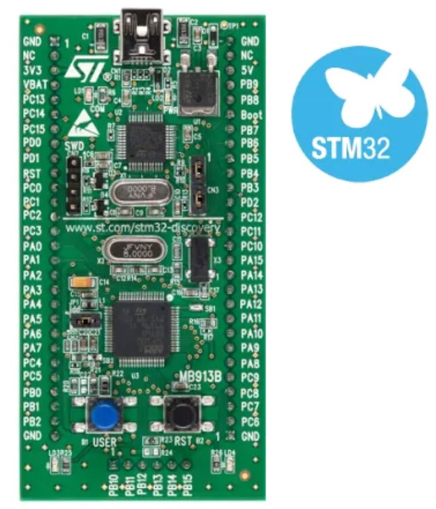

# STM32_ADC_DMA_TIM_sampling_project
An example project for STM32 use TIM3 + DMA + ADC to do automatic sampling without MCU intervation

Dev board is [STM32F100 discovery](https://www.st.com/en/evaluation-tools/stm32vldiscovery.html)

Please check more details in [my post](https://www.iotcolon.com/?p=708) 
